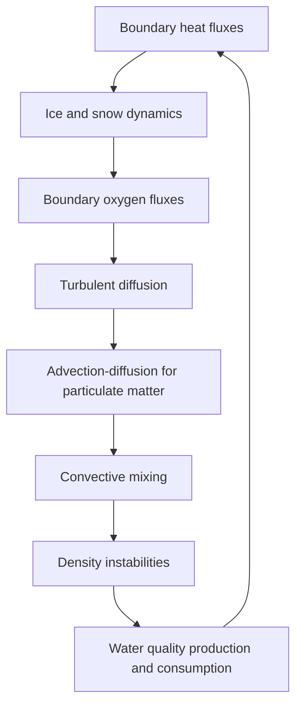

# Lake-M<sup>3</sup> (Minimalistic Metabolism Model)

-----

:busts_in_silhouette: Robert Ladwig, Emma Marchisin, Bennett McAfee, Ahmed Elhabashy, Cal Buelo, Paul C Hanson

:email: [contact](mailto:rladwig@ecos.au.dk)
:computer: [more info](https://www.robert-ladwig.com/software)

-----
## Overview
Lake-M<sup>3</sup> is based on [LakeModelR](https://github.com/robertladwig/LakeModelR) and [1D-AEMpy](https://github.com/robertladwig/1D-AEMpy), which were both for the most part developed at the University of Wisconsin-Madison to support lake modeling projects with focus on [Ecological Knowledge-Guided Machine Learning](https://eco-kgml.github.io/). The current Lake-M<sup>3</sup> is an on-going collaboration between the University of Wisconsin-Madison and Aarhus University. The model is heavily inspired by [MyLake](https://github.com/biogeochemistry/MyLake_public) and we acknowledge that many process descriptions are based on its source code.

## Modeling philosophy
Lake-M<sup>3</sup> is based on the philosophy to develop a modularized, easy-to-modify (that's why it's completely in Python), vertical 1D aquatic ecosystem with focus on freshwater metabolism. The model simulates water temperature, dissolved oxygen and organic carbon (dissolved and particulate as well as labile and refractory) dynamics using the general equations in the forms of:

$A \frac{\partial T}{\partial t}=\frac{\partial}{\partial z}(A K_z \frac{\partial T}{\partial z}) + \frac{1}{{\rho_w c_p}}\frac{\partial H(z)}{\partial z}  + \frac{\partial A}{\partial z}\frac{H_{geo}}{\rho_w c_p}$

$A \frac{\partial C}{\partial t} + w \frac{\partial C}{\partial z} - \frac{\partial}{\partial z}(A K_z \frac{\partial C}{\partial z}) = P(C) - D(C)$

where $T$ is water temperature, and $C$ represents a water quality state variable. Water temperature and heat transport are simulated using an eddy-diffusion approach in which the turbulent eddy diffusivity coefficients are parameterized based on the gradient Richardson number. To ensure stability, we apply the implicit Crank-Nicolson scheme for the diffusive transport. Production and consumption terms of the water quality dynamics (dissolved oxygen, phytoplankton biomass, nutrients and organic carbon) are simulated using a modified Patankar Runge-Kutta scheme to ensure mass conservation and to prevent unrealistic negative values. Convective wind mixing is parameterized based on an integral energy approach. Further, the model projects growth and decay of ice and snow, as well as coupled feedback loops between organic matter and water clarity.

## Modules
Lake-M<sup>3</sup> is an integrated physics-ecology model which process-specific modules. These can be easily modified to test alternative hypotheses and mechanisms.



## How to use it
Example runfiles will be added soon. You can use the model by importing and running it into your Python script:
```
import sys 
sys.path.append('/.../Lake-m3/src')
from processBased_lakeModel_functions import get_hypsography, provide_meteorology, initial_profile, run_wq_model, wq_initial_profile, provide_phosphorus, provide_carbon, do_sat_calc, calc_dens,atmospheric_module, get_secview, get_lake_config, get_model_params, get_run_config, get_ice_and_snow , get_num_data_columns

res = run_wq_model(...)
```
